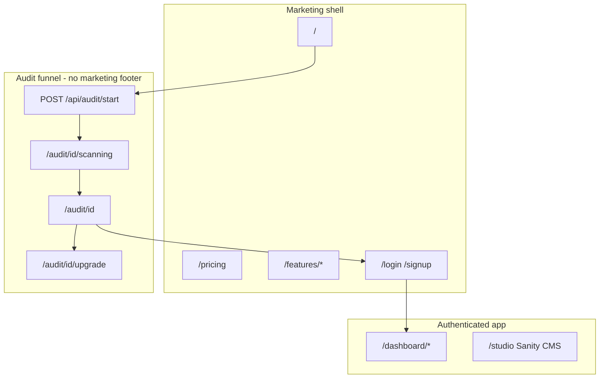
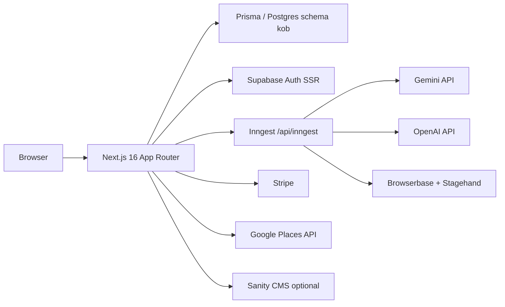

# KOB — Product & Technical Design

**Handoff doc for [cofounder.co](https://cofounder.co) and external builders.**  
This is the single reference for what KOB is, how it is built, and what is done vs. in progress.

Related docs:

- [DEPLOYMENT.md](./DEPLOYMENT.md) — Netlify, Supabase auth URLs, Inngest production sync
- [.env.example](../.env.example) — full environment variable catalog
- [kob-master-prompt.md](./kob-master-prompt.md) — brand voice and quality bar
- [downloads/owner.com-DESIGN.md](../downloads/owner.com-DESIGN.md) — competitive design token reference (do not copy Owner copy)

---

## 1. Executive summary

### What KOB is

KOB is a **hospitality growth platform** for independent restaurants, retailers, and food markets. The product leads with a **free AI visibility audit** (website, Google presence, photos, reviews), then converts operators into a paid workspace: websites, SEO, direct ordering, marketing automations, and a **Growth Agent** that surfaces weekly priorities.

### Who it is for

Independent operators who want **direct revenue** (own their site, ordering, and guest data) without marketplace commissions eating margin. Public copy uses:

> **Trusted by over 500 retailers, restaurants and markets worldwide**

(Source: `lib/marketing/copy.ts`)

### North-star conversion

```text
Homepage audit form
  → POST /api/audit/start
  → /audit/{id}/scanning (live progress)
  → /audit/{id} (report; email + phone unlock)
  → /audit/{id}/upgrade (trial / Stripe)
  → /dashboard (Growth Agent + tools)
```

### Positioning (tone)

See [kob-master-prompt.md](./kob-master-prompt.md). KOB should feel **calm, premium, hospitality-native** — comparable visual quality to Sunday App, Owner.com, Stripe, Linear. It must **not** feel like a generic SaaS dashboard, agency portfolio, or dark-mode “AI startup.”

---

## 2. Product surfaces (three shells)

KOB is one Next.js app with **three distinct UI shells**. Do not mix patterns across shells without intent.



| Shell | Wrapper | Routes | Notes |
|-------|---------|--------|-------|
| **Marketing** | `SaasMarketingShell` via `MarketingPageChrome` | `/`, `/pricing`, `/features/*`, `/login`, `/signup`, `/product`, `/demo`, … | Header + footer; cream/green SaaS template |
| **Audit funnel** | No marketing footer; `AuditFunnelHeader` / grader chrome | `/audit`, `/audit/[id]`, `/audit/[id]/scanning`, `/audit/[id]/upgrade` | Owner-style grader UX — **do not restyle or change flow unless explicitly requested** |
| **Dashboard** | `DashboardShell` | `/dashboard/*` | Supabase auth required; sidebar nav |

**Chrome routing logic:** `components/marketing/MarketingPageChrome.tsx` skips the marketing shell when the path matches `/audit/[id](/scanning|upgrade(/checkout)?)?`.

---

## 3. Route map

### Public marketing

| Path | Entry | Purpose |
|------|-------|---------|
| `/` | `app/(marketing)/page.tsx` → `SaasLandingPage` | Hero audit form, trust band, benefit tabs, ecosystem tabs, quote marquee |
| `/pricing` | `SaasPricingPage` | Flex **$125/mo + 2.5%** · Flat **$250/mo** (see `lib/marketing/pricing-plans.ts`) |
| `/features/website` | `SaasWebsiteFeaturePage` | Website pillar + benefit tabs + FAQ |
| `/features/online-ordering` | `SaasPillarFeaturePage` | Ordering pillar (from `owner-pillars`) |
| `/features/delivery` | `SaasPillarFeaturePage` | Delivery pillar |
| `/features/branding` | Marketing feature page | Brand / app story |
| `/features/ai-menu` | Marketing feature page | Menu / AI menu story |
| `/product` | Product overview | High-level platform story |
| `/demo` | `DemoPage` | Demo request form → `POST /api/demo-request` |
| `/resources` | Resources | Content hub (light) |
| `/solutions` | Solutions | Persona / use-case page |
| `/login` | `SaasAuthPage` (sign-in) | Supabase magic link |
| `/signup` | `SaasAuthPage` (sign-up) | Magic link; `?plan=flex\|flat` → billing intent after auth |

### Audit funnel

| Path | Purpose |
|------|---------|
| `/audit` | Standalone audit entry + business search |
| `/audit/[id]/scanning` | Animated scan UX; polls audit API for scores, `geoLocation`, `competitors` |
| `/audit/[id]` | Full report (`AuditReportDashboard`) |
| `/audit/[id]/upgrade` | Trial / upgrade panel |
| `/audit/[id]/upgrade/checkout` | Stripe checkout handoff for audit unlock |

### Dashboard (authenticated)

All under `app/dashboard/` — shell in `components/dashboard/DashboardShell.tsx`.

| Path | Focus |
|------|--------|
| `/dashboard` | Today / overview metrics |
| `/dashboard/growth-agent` | Daily briefing, priorities |
| `/dashboard/seo` | Keywords, SEO tools |
| `/dashboard/website` | Website redesign panel |
| `/dashboard/reviews` | Review relationship AI |
| `/dashboard/outbound` | Outbound lead workspace |
| `/dashboard/marketing` | Campaigns / marketing |
| `/dashboard/content` | Generated content |
| `/dashboard/ordering` | Ordering (wireframe) |
| `/dashboard/mobile` | Branded app story |
| `/dashboard/brand` | Brand visuals |
| `/dashboard/visuals` | Food photography AI |
| `/dashboard/billing` | Stripe checkout / portal |
| `/dashboard/settings` | Restaurant settings |
| `/dashboard/analytics` | Analytics (preview) |
| `/dashboard/customers` | Customers (preview) |
| `/dashboard/redesign` | Redesign workflow |

Many dashboard pages use **static preview data** when `NEXT_PUBLIC_UI_PREVIEW` is set — see `lib/preview/static-dashboard-data.ts`.

### Other

| Path | Purpose |
|------|---------|
| `/auth/callback` | Supabase OAuth / magic-link exchange |
| `/studio/[[...tool]]` | Sanity Studio (optional CMS) |

---

## 4. Design system

### Design philosophy

- **Marketing (SaaS template):** warm cream canvas `#f9f3ed`, forest green CTAs `#094413`, accent `#088924`, ink text `#2c2c2c`, large rounded corners (`rounded-3xl`), subtle borders `border-[#2c2c2c]/10`.
- **Audit funnel:** tighter Owner.com grader patterns — uses `lib/marketing/owner-ui-classes.ts` and CSS variables from `app/globals.css`.
- **Dashboard:** product UI; DM Sans + app surface tokens (`--color-surface-soft`).

Quality benchmark: [kob-master-prompt.md](./kob-master-prompt.md). Use [owner.com-DESIGN.md](../downloads/owner.com-DESIGN.md) for **tokens only**, not trademarked copy or fake case studies.

### Color tokens (`app/globals.css`)

| Token | Hex / value | Use |
|-------|-------------|-----|
| `--color-primary` | `#094413` | Primary buttons, brand |
| `--color-primary-hover` | `#0c5518` | Hover |
| `--color-accent` | `#088924` | Success, badges, links |
| `--color-surface-cream` | `#f9f3ed` | Marketing page background |
| `--color-surface-beige` | `#f6eee5` | Section alternates |
| `--color-surface-warm` | `#fbf8f5` | Cards on cream |
| `--color-ink` / `--color-body` | `#2c2c2c` | Body text |

SaaS components often hardcode the same hex values in Tailwind classes for clarity.

### Typography

| Class | Stack | Use |
|-------|-------|-----|
| `font-heading` | STK Bureau Sans (+ DM Sans fallback) | Headlines |
| `font-body` | SuisseIntl (+ Helvetica fallback) | Body (audit / Owner surfaces) |
| `font-mono-brand` | Fragment Mono | Eyebrows, labels, stats |

Root layout loads **DM Sans** via `next/font` (`app/layout.tsx`). Display fonts for Owner-style surfaces are loaded via `@font-face` in `globals.css` (CDN woff2).

### Layout

| Utility | Value | Where |
|---------|-------|-------|
| `ownerContainer` | `max-w-[90rem]` | Audit / Owner marketing |
| SaaS max width | `max-w-[83rem]` | `SaasMarketingHeader`, landing sections |

### Marketing component inventory (`components/marketing/saas/`)

| Component | Role |
|-----------|------|
| `SaasMarketingShell` | Header + main + footer wrapper |
| `SaasMarketingHeader` / `SaasMarketingFooter` | Nav, products dropdown, sign in/up |
| `SaasLandingPage` | Homepage section stack |
| `SaasHeroSection` + `SaasHeroAuditForm` | Hero + audit start (Places / URL) |
| `SaasTrustBand` | “500+” trust line (replaces removed case studies) |
| `SaasBenefitTabs` | Owner-style pill/underline benefit tabs |
| `SaasFaqAccordion` | Pricing / feature FAQs |
| `SaasPricingPage` | Two-tier pricing |
| `SaasWebsiteFeaturePage` | Website pillar landing |
| `SaasEcosystemTabs` | Traffic → ordering → loyalty story |
| `SaasRatingsMarquee` | Generic quotes (no fake names / dollar stats) |
| `SaasAuthPage` / `SaasAuthForm` | Magic-link auth with sign-in \| sign-up tabs |
| `SaasPillarFeaturePage` | Reusable pillar pages from `owner-pillars` |

### Audit component inventory (`components/marketing/audit/`)

Key files — **treat as production funnel, not draft:**

| Component | Role |
|-----------|------|
| `AuditBusinessSearch` | Places autocomplete on audit entry |
| `AuditScanningExperience` | Full scanning page orchestration |
| `AuditScanningMap` | Map + competitor pins (Maps JS or static fallback) |
| `AuditReportDashboard` | Scores, benchmark, media, competitors, unlock |
| `AuditUnlockModal` / `AuditLeadForm` | Email + phone lead gate |
| `AuditUpgradePanel` / `AuditUpgradeCheckout` | Trial / Stripe upgrade |
| `AuditGraderHeader` / `AuditFunnelHeader` | Minimal grader chrome |

### Content rules (marketing)

- **No** fake named case studies (Cyclo, Saffron, Karv, etc. removed).
- **No** fabricated revenue stats in UI (+210%, named owners).
- Trust line and CTAs live in **`lib/marketing/copy.ts`** — edit there, not scattered in components.
- Pricing numbers are canonical in **`lib/marketing/pricing-plans.ts`**: Flex $125 + 2.5%, Flat $250.
- Quote marquee uses anonymous “Independent operator” attribution.

### Icons

`SaasIcon` wraps **Iconify** (`iconify-icon`) with Solar icon set, e.g. `solar:verified-check-linear`.

---

## 5. Core user journeys

### A. Free visibility audit (no login)

1. **Start** — User enters restaurant via Google Places (`AuditBusinessSearch` / `SaasHeroAuditForm`) or website URL.
2. **API** — `POST /api/audit/start` (`lib/audit/audit-start-shared.ts`) creates `VisibilityAudit`, kicks pipeline.
3. **Redirect** — Browser goes to `/audit/{id}/scanning`.
4. **Poll** — Client calls `GET /api/audit/[id]` until `resultPayload` has scores; includes `geoLocation` and `competitors` when Places data available.
5. **Pipeline** — `lib/audit/execute-audit-pipeline.ts`:
   - Fetch/normalize URL, HTML analysis (`website-analysis-pipeline`, `analyze-url`)
   - Optional **Browserbase** / **Stagehand** for JS-heavy sites
   - **Gemini** benchmark scoring (often async via Inngest)
   - Optional **OpenAI** narrative enrichment
   - Competitors via `lib/audit/fetch-nearby-competitors.ts` + `resolve-audit-location.ts`
6. **Report** — `/audit/[id]` renders `AuditReportDashboard` with rubric v2 scores, issues, opportunities, media benchmark.
7. **Unlock** — `POST /api/audit/[id]/lead` with email + phone → full report visible.
8. **Upgrade** — `/audit/[id]/upgrade` → Stripe Checkout or account trial via `/api/trial`.

**Without Inngest running locally**, audits persist but Gemini benchmark may stay **pending** — see DEPLOYMENT.md.

### B. Sign up and dashboard

1. User visits `/login` or `/signup` → email magic link via Supabase (`SaasAuthForm`).
2. `GET /auth/callback` exchanges code → session cookie → redirect to `next` param (default `/dashboard`).
3. `middleware.ts` refreshes Supabase session; blocks `/dashboard` if env missing.
4. User creates/links **Restaurant** via `RestaurantOnboardingForm` (`POST /api/restaurants`).
5. **Growth Agent** features call `/api/growth-agent/*` (briefing, redesign, food photography, reviews, outbound draft).

### C. Billing

| Marketing plan | Stripe tier | Env price ID |
|----------------|-------------|--------------|
| Flex (`plan=flex`) | `starter` | `STRIPE_PRICE_STARTER` (or `STRIPE_GROWTH_PRICE_ID` for trial API) |
| Flat (`plan=flat`) | `pro` | `STRIPE_PRICE_PRO` |

- Logged-in checkout: `POST /api/billing/checkout` with `{ restaurantId, tier }`.
- New restaurant + trial: `POST /api/trial` with `{ restaurantName, tier, mode: "checkout" }`.
- Webhook: `POST /api/stripe/webhook` syncs subscription state (`lib/billing/sync-stripe-subscription.ts`).
- Customer portal: `POST /api/billing/portal`.

**Gap:** Marketing CTAs work without Stripe; live checkout requires all `STRIPE_*` keys in `.env.local` / Netlify.

---

## 6. Architecture



### Stack

| Layer | Technology |
|-------|------------|
| Framework | Next.js **16.2** (App Router) — see `AGENTS.md`: APIs differ from Next 15 |
| UI | React **19**, Tailwind **4**, Framer Motion |
| DB | PostgreSQL via Prisma **6**; schema name **`kob`** |
| Auth | Supabase (`@supabase/ssr`) magic link |
| Jobs | Inngest **4** (`inngest/functions.ts`, served at `/api/inngest`) |
| AI | Google Gemini (audit benchmark + vision), OpenAI (optional narrative + growth agent) |
| Render | Browserbase + Playwright-core + optional Stagehand |
| Payments | Stripe **17** subscriptions |
| CMS | Sanity **5** (optional homepage) |
| Deploy | Netlify + `@netlify/plugin-nextjs` (`netlify.toml`) |

### Key directories

| Path | Responsibility |
|------|----------------|
| `app/(marketing)/` | Public marketing + audit pages |
| `app/dashboard/` | Authenticated product UI |
| `app/api/` | REST route handlers |
| `lib/audit/` | Audit pipeline, scoring, types, Places |
| `lib/growth-agent/` | AI generators + Zod schemas |
| `lib/billing/` | Stripe checkout, plan access |
| `lib/marketing/` | Copy, pricing, pillars, UI classes |
| `lib/places/` | Google Places server helpers |
| `inngest/` | Background functions |
| `prisma/` | Schema + migrations |
| `components/marketing/` | Marketing + audit UI |
| `components/dashboard/` | Dashboard UI |

### Inngest functions (summary)

| Function ID | Trigger | Role |
|-------------|---------|------|
| `growth-ingestion-hourly` | Cron hourly | Fan-out normalization per restaurant |
| `growth-normalization` | Event | Integration metadata normalization |
| `growth-insight-detection` | Event | Rule-based insights |
| `growth-ai-recommendations` | Event | AI recommendations persistence |
| `audit-background-run` | Event | Full audit pipeline retry/async |
| `audit-browserbase-render` | Event | JS render + screenshot capture |
| `audit-enrichment` | Event | OpenAI narrative |
| `audit-gemini-benchmark` | Event | Gemini absolute benchmark + media |
| `growth-daily-digest` | Cron | Digest emails |
| `outbound-draft-daily` | Cron | Outbound draft generation |
| `outbound-send-approved` | Cron | Send approved outbound |

Local dev: `npm run dev:audit` (site + Inngest) or `npm run dev:public` + `npm run inngest:dev` (UI at http://localhost:8288).

---

## 7. Data model

All Prisma models use PostgreSQL schema **`kob`** (not `public`). See `prisma/schema.prisma`.

### Core entities

```text
User (Supabase-linked)
  └── TeamMember ──► Restaurant
                        ├── SubscriptionPlan: FREE | STARTER | PRO
                        ├── stripeCustomerId, stripeSubscriptionId
                        └── visibilityAudits[], integrations[], insights[], ...
```

### Audit funnel

```text
VisibilityAudit
  ├── restaurantName, city, websiteUrl
  ├── overallScore, seoScore, designScore, mobileScore, conversionScore
  ├── resultPayload (JSON — full AuditResultPayload)
  ├── leadEmail, leadPhone, leadCapturedAt
  └── SiteScan (1:1)
        ├── screenshotUrls[], browserbaseSessionId
        └── visualMetricsJson, rawStagehandJson
```

`resultPayload` shape: `lib/audit/types.ts` (`AuditResultPayload`) — scores, issues, opportunities, competitors, geo, benchmark blocks, media assets.

### Growth & content

| Model | Purpose |
|-------|---------|
| `GrowthInsight` | Detected opportunities/problems |
| `Recommendation` | Actionable items linked to insights |
| `GeneratedContent` | AI drafts (blog, SEO page, email, etc.) |
| `Campaign` | Marketing campaigns |
| `Keyword` | SEO keyword tracking |
| `OutboundLead` | Outbound sales leads |
| `Integration` | OAuth tokens per provider (GA, GSC, social, POS, etc.) |
| `CustomerReview` / `ReviewerProfile` | Review intelligence |
| `DigestRun` / `DailyScan` | Scheduled digest / scans |
| `DemoRequest` | Marketing demo form submissions |
| `StripeWebhookEvent` | Idempotent webhook log |

### Subscription mapping

| DB `SubscriptionPlan` | Marketing name | Stripe env |
|-------------------------|----------------|------------|
| `FREE` | Free / trial pending | — |
| `STARTER` | Flex | `STRIPE_PRICE_STARTER` |
| `PRO` | Flat | `STRIPE_PRICE_PRO` |

---

## 8. API surface

Base path: `/api`. Auth via `requireApiUser()` from `lib/auth/api-session.ts` unless noted.

### Audit (mostly public)

| Method | Path | Auth | Notes |
|--------|------|------|-------|
| POST | `/api/audit/start` | Public | Rate-limited; creates audit |
| POST | `/api/audit/run` | Varies | Manual / internal run |
| GET | `/api/audit/[id]` | Public | Poll scan results |
| POST | `/api/audit/[id]/lead` | Public | Capture lead; unlock report |

### Places (server proxy)

| Method | Path | Notes |
|--------|------|-------|
| GET | `/api/places/autocomplete` | Places API (New) |
| GET | `/api/places/details` | Place details |
| GET | `/api/places/static-map` | Static map image fallback |
| GET | `/api/places/status` | Config health |

### Billing

| Method | Path | Auth |
|--------|------|------|
| POST | `/api/billing/checkout` | User |
| POST | `/api/billing/portal` | User |
| POST | `/api/trial` | User |
| POST | `/api/stripe/webhook` | Stripe signature |

### Growth Agent

| Method | Path |
|--------|------|
| POST | `/api/growth-agent/daily-briefing` |
| POST | `/api/growth-agent/website-redesign` |
| POST | `/api/growth-agent/food-photography` |
| POST | `/api/growth-agent/review-relationship` |
| POST | `/api/growth-agent/outbound-draft` |

### Restaurant & growth data

| Method | Path |
|--------|------|
| GET/POST | `/api/restaurants` |
| GET | `/api/insights` |
| GET/POST | `/api/recommendations` |
| POST | `/api/keywords`, `/api/keywords/refresh` |
| POST | `/api/content/generate` |
| GET/POST | `/api/integrations` |
| GET | `/api/briefing` |
| GET | `/api/digest/preview` |

### Ops

| Method | Path |
|--------|------|
| GET/POST/PUT | `/api/inngest` | Inngest serve endpoint |
| GET | `/api/cron/outbound` | Cron shim (secret) |
| POST | `/api/demo-request` | Public demo form |

---

## 9. Environment and local development

Copy template: `cp .env.example .env.local`

### Required by feature

| Feature | Required variables | If missing |
|---------|-------------------|------------|
| Database | `DATABASE_URL` | App errors on Prisma |
| Auth | `NEXT_PUBLIC_SUPABASE_URL`, `NEXT_PUBLIC_SUPABASE_ANON_KEY` | Dashboard redirect to `/login?error=missing_env` |
| Audit (basic) | `DATABASE_URL`, `GEMINI_API_KEY` | No benchmark scores |
| Audit (location) | `GOOGLE_PLACES_API_KEY` | Weak/no competitors map |
| Audit (async jobs) | `INNGEST_DEV=1` locally; `INNGEST_SIGNING_KEY` + `INNGEST_EVENT_KEY` in prod | Benchmark stays pending |
| Scanning map (live) | `NEXT_PUBLIC_GOOGLE_MAPS_API_KEY` | Falls back to `/api/places/static-map` |
| Billing | `STRIPE_SECRET_KEY`, `STRIPE_PRICE_STARTER`, `STRIPE_PRICE_PRO`, webhook secret | Checkout 503 |
| Browserbase | `BROWSERBASE_API_KEY`, `BROWSERBASE_PROJECT_ID` | HTML-only fetch for JS sites |
| OpenAI enrichment | `OPENAI_API_KEY` | Skips narrative jobs |
| Sanity CMS | `NEXT_PUBLIC_SANITY_PROJECT_ID` | Homepage defaults only |

### Commands

| Command | Purpose |
|---------|---------|
| `npm run dev:kob` | Dev server on port **3333** |
| `npm run dev:public` | Dev on port **3000** (pairs with Inngest dev URL) |
| `npm run dev:audit` | Site + Inngest worker together |
| `npm run inngest:dev` | Inngest dev UI → http://localhost:8288 |
| `npm run build` | `prisma generate` + `next build` |
| `npm run db:migrate` | Apply migrations (loads `.env.local`) |
| `npm run setup:auth-urls` | Print Supabase redirect URLs |
| `npm run smoke:check` | Post-deploy smoke tests |

Set `NEXT_PUBLIC_APP_URL` and `NEXT_PUBLIC_SITE_URL` to your actual origin (including port in dev).

---

## 10. Deployment

Full checklist: **[DEPLOYMENT.md](./DEPLOYMENT.md)**

Summary:

1. **Netlify** — import Git repo; `netlify.toml` sets `npm run build` and Next plugin.
2. **Env vars** — copy production values from `.env.local` into Netlify UI.
3. **Supabase** — add redirect URLs for prod + localhost (`npm run setup:auth-urls`).
4. **Post-deploy** — `npm run db:migrate`.
5. **Inngest** — register app; sync `https://<site>.netlify.app/api/inngest`; add signing + event keys.
6. **Stripe** — webhook endpoint `https://<site>/api/stripe/webhook` (can defer until core funnel works).

---

## 11. Build status matrix

Honest snapshot for handoff planning:

| Area | Status | Notes |
|------|--------|-------|
| Marketing homepage | **Done** | SaaS template, audit hero, trust band, benefit tabs |
| Pricing page | **Done** | $125 Flex / $250 Flat; signup CTAs |
| Website feature page | **Done** | Benefit tabs + FAQ |
| Auth (login/signup) | **Done** | Magic link; needs Supabase keys |
| Audit funnel UI | **Done** | Do not redesign without approval |
| Audit pipeline + geo/competitors | **Largely done** | Accuracy tuning ongoing |
| Gemini benchmark (Inngest) | **Done** | Requires Inngest in each environment |
| Dashboard shell + nav | **Done** | |
| Growth Agent panels | **Mixed** | APIs exist; some UI uses preview/static data |
| Stripe live checkout | **Code ready** | Keys + webhook required |
| Third-party integrations | **Schema + stubs** | GA, GSC, social, POS enums in Prisma |
| Sanity homepage | **Optional** | Falls back to `lib/homepage-defaults.ts` |
| Delivery / some `/features/*` | **Placeholder** | Pillar copy from `owner-pillars` |
| Outbound email (Resend) | **Optional** | Cron + Inngest paths exist |

---

## 12. Constraints for external builders (cofounder.co)

1. **Do not change the audit funnel** styling, step order, or lead-gate behavior unless the product owner explicitly asks.
2. **Next.js 16** — read `node_modules/next/dist/docs/` before changing routing, middleware, or data APIs (`AGENTS.md`).
3. **Single source for marketing copy** — `lib/marketing/copy.ts` and `lib/marketing/pricing-plans.ts`.
4. **No fake social proof** — no named fake restaurants, fabricated dollar outcomes, or Owner trademark case studies.
5. **Pricing** — public site uses **$125 + 2.5%** (Flex) and **$250 flat** (Flat); do not revert to placeholder “£X”.
6. **Schema** — all Prisma models use `@@schema("kob")`; migrations must stay compatible.
7. **Minimize scope** — match patterns in `components/marketing/saas/` for new marketing UI; use `owner-ui-classes` only on audit/grader surfaces.
8. **Commits** — only when asked; no force-push to main.

---

## 13. Related files index (start here)

| Topic | Path |
|-------|------|
| Marketing copy | `lib/marketing/copy.ts` |
| Pricing data | `lib/marketing/pricing-plans.ts` |
| Benefit tab content | `lib/marketing/pillar-benefit-tabs.ts` |
| Product pillars | `lib/marketing/owner-pillars.ts` |
| Owner UI utilities | `lib/marketing/owner-ui-classes.ts` |
| Global CSS tokens | `app/globals.css` |
| Marketing chrome | `components/marketing/MarketingPageChrome.tsx` |
| Homepage | `components/marketing/saas/SaasLandingPage.tsx` |
| Audit start API | `app/api/audit/start/route.ts` |
| Audit pipeline | `lib/audit/execute-audit-pipeline.ts` |
| Audit types | `lib/audit/types.ts` |
| Audit report UI | `components/marketing/audit/AuditReportDashboard.tsx` |
| Scanning UX | `components/marketing/audit/AuditScanningExperience.tsx` |
| Inngest jobs | `inngest/functions.ts` |
| Prisma schema | `prisma/schema.prisma` |
| Auth middleware | `middleware.ts` |
| Supabase server client | `lib/supabase/server.ts` |
| Stripe helpers | `lib/billing/stripe-server.ts` |
| Checkout session | `lib/billing/checkout-subscription-session.ts` |
| Growth Agent | `lib/growth-agent/index.ts` |
| Dashboard shell | `components/dashboard/DashboardShell.tsx` |
| Env template | `.env.example` |
| Deploy guide | `docs/DEPLOYMENT.md` |
| Brand master prompt | `docs/kob-master-prompt.md` |
| Competitive design tokens | `downloads/owner.com-DESIGN.md` |

---

## Appendix: Audit `resultPayload` (high level)

Stored on `VisibilityAudit.resultPayload` (JSON). Parsed by `parseAuditPayload()` in `lib/audit/types.ts`.

Typical sections:

- `scores` — overall, seo, design, mobile, conversion
- `issues` / `opportunities` — ranked fix list
- `competitors` — nearby venues with optional `lat`/`lng`, `source`
- `geoLocation` — audit anchor for maps
- `benchmark` / `benchmarkMedia` — Gemini narrative + media quality
- `labels` — human-readable category labels from `derive-audit-labels.ts`

Scoring rubric: `lib/audit/rubric-v2.ts`, applied via `apply-audit-scoring.ts`.

---

*Last updated for cofounder.co handoff. For operational runbooks, see [DEPLOYMENT.md](./DEPLOYMENT.md).*
