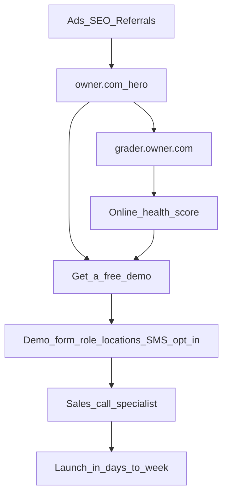

# Owner.com competitor intel

**Updated:** 2026-06-20  
**Sources:** [owner.com/pricing](https://www.owner.com/pricing), [grader.owner.com](https://grader.owner.com), [dashboard.owner.com](https://dashboard.owner.com) (login wall), product pages `/mobile`, `/reporting-analytics`, `/kitchen-tablet`, `npm run crawl:owner:free` → `downloads/owner-crawl/20260619-2240/`, design extract → `downloads/owner.com-DESIGN.md`

> **Note:** Full [Browserbase competitor-analysis skill](https://www.skills.sh/browserbase/skills/competitor-analysis) is installed at `.agents/skills/competitor-analysis`. It needs `BROWSERBASE_API_KEY` + `browse` CLI for deep web discovery. This brief uses the free Owner crawl + live public pages.

**Related domains discovered:** `grader.owner.com`, `help.owner.com`, `dashboard.owner.com`

---

## Pricing (verified live)

| Plan | Monthly | Order fees | Notes |
|------|---------|------------|-------|
| **Flex** | **$249/mo** | **+ 5% restaurant fee** per order | Lower sub; costs scale with sales |
| **Flat** | **$499/mo** | **No restaurant fees** | Best for $5k+/mo online sales |

- **No long-term contracts** — month-to-month, cancel anytime (Owner FAQ).
- **Guests pay 5% order support fee** on both plans (fulfillment + CS) — separate from restaurant fee on Flex.
- **Multi-location:** special rates available (Flex).
- **KOB founding anchor:** $49 Flex / $99 Flat — still ~5× cheaper on monthly.

---

## What Owner sells (all plans)

Full **revenue stack**, not a daily-helper tool:

- AI-optimized website + automated SEO pages
- Online ordering + smart upsells
- Branded mobile app + loyalty/rewards
- AI marketing (email/SMS/push)
- Direct catering, delivery, chargeback protection
- Setup & migration with **dedicated specialist**
- 24/7 support

**Positioning:** “Performance beats endless customization” — you give up some design control for a proven system. AI for independents to match national brands. Profit growth above all.

---

## Client dashboard & ops tools

**We did not get inside the logged-in UI** at [dashboard.owner.com](https://dashboard.owner.com). Below is from Owner’s public product pages ([/reporting-analytics](https://www.owner.com/reporting-analytics), [/mobile](https://www.owner.com/mobile), [/kitchen-tablet](https://www.owner.com/kitchen-tablet)).

### Product map (Owner’s “Run your restaurant” stack)

| Surface | URL | What the owner gets |
|---------|-----|---------------------|
| **Web dashboard** | `dashboard.owner.com` | Sales, order sources, SEO, Google reviews, campaign performance — one place |
| **Owner App** | [owner.com/mobile](https://www.owner.com/mobile) | Phone control: live sales, alerts, refunds, menu edits, hours, delivery toggle |
| **Kitchen tablet** | [owner.com/kitchen-tablet](https://www.owner.com/kitchen-tablet) | All channels on one device: orders, menu, gift cards, busy mode, printer |
| **POS integrations** | [owner.com/pos-integrations](https://www.owner.com/pos-integrations) | Clover etc. — sync with in-store POS |

### Web dashboard & reporting

- Total sales + **where orders come from**
- **SEO performance** + Google review counts driven
- **Marketing campaign** results
- **Growth signals** — flags what to improve (SEO gaps, underperforming campaigns)
- Export customer lists; new vs returning customers over time ([blog](https://www.owner.com/blog/restaurant-analytics))

### Owner App (owner’s phone)

- Today’s sales, open tickets, top sellers — **refreshes ~every 3 seconds**
- **SMS/push alerts** when orders stall, prep times spike, stock runs low
- Cancel, refund, convert orders; call/text driver from ticket
- **86 items**, edit prices/descriptions, publish photos in a few taps
- Update hours or toggle delivery — syncs to web, kiosk, marketplaces in seconds
- iOS 15+ / Android 11+

### Kitchen tablet

- Lenovo Yoga Tab 11, pre-installed Owner kitchen app + Bluetooth printer
- Online, phone, and in-store orders on **one screen**
- Full menu control from kitchen; busy mode; prep time adjustments
- Requires Wi‑Fi (no offline mode)

### vs KOB dashboard

| | Owner.com | KOB |
|---|-----------|-----|
| **Job** | Run ordering, kitchen, marketing, analytics | Daily visibility tasks — reviews, hours, holidays, posts |
| **Depth** | Full ops platform (POS-adjacent) | Lightweight helper — approve fixes in one tap |
| **Entry** | Demo → specialist → ~1 week launch | Free scan → self-serve trial |
| **Mobile** | Live order ops + menu control | Task approvals + briefings (not a kitchen KDS) |

**KOB talk track:** Owner is for restaurants ready to **replatform direct ordering**. KOB is for owners who want to **stop missing things online** without replacing their stack.

---

## Go-to-market funnel

| Step | Owner.com | KOB (trykob.com) |
|------|-----------|------------------|
| Top CTA | “Get a free demo” (nav + pricing) | Free scan (~1 min) |
| Lead magnet | [grader.owner.com](https://grader.owner.com) — SEO/site health score | `/audit` visibility scan |
| Signup | Demo form + SMS consent; sales schedules call | Self-serve trial (7 days) |
| Onboarding | Dedicated specialist; domain/GBP/Yelp; **launch in ~1 week** | Connect restaurant; daily task list |
| Proof | Case studies (+54% sales, $7M direct orders) | Founding pricing + scan report |

---

## Design system (extracted from Owner.com)

Full token doc: **`downloads/owner.com-DESIGN.md`** (801 lines). KOB already maps many tokens in **`app/globals.css`** and **`lib/marketing/owner-ui-classes.ts`**.

### Brand & color

| Token | Value | Use |
|-------|-------|-----|
| Canvas | `#c2edce` | Mint hero background — signature Owner look |
| Primary | `#094413` | Forest green — main CTAs |
| Accent | `#088924` | Brighter green — “Get my AI report” / scan actions |
| Ink | `#2c2c2c` | Body text (not pure black) |
| Surface warm/beige/cream | `#fbf8f5` / `#f6eee5` / `#f9f3ed` | Cards, pricing bands, nav CTA text on dark button |

### Typography

- **Headlines / buttons:** STK Bureau Sans (600 max — no heavy 700+)
- **Body:** System stack (Helvetica → Arial → CJK fallbacks)
- **Display hero:** 88px, **-3.52px** letter-spacing — tight editorial feel
- **Principle:** Scale up before weight up; negative tracking only on large display type

### Layout & components

- **Max width:** 1440px — wider than typical SaaS (power-user / owner-at-laptop)
- **Nav:** 72px sticky white bar — logo | menu | Login | **dark “Get a free demo”** CTA (ink bg + cream text)
- **Hero:** Asymmetric split — left copy + fused **input capsule** (32px radius); right **phone mockup** overlapping bottom
- **Phone mockup:** Score ring (e.g. 36/100), warm card interior, food avatar — product proof before abstract claims
- **Corners:** Aggressive rounding — 16px default, 24px cards/inputs, 32–64px hero elements
- **CTA hierarchy:** Dark nav demo button vs green in-content primary vs accent for instant report

### Motion & polish

- Scroll-triggered **fade-up** on sections
- Score ring **draw animation** on load
- Button press **scale(0.97)** with decelerate easing
- Testimonial **marquee** strips
- Cubic-bezier transitions ~300–450ms

### Imagery

- **Product-first** — phone UI mockup in hero, not stock photos of staff
- Food photo only as **48px circle** in mockup
- Below fold: case study stats, dashboard screenshots, restaurant interiors

---

## KOB design — already applied vs still to do

### Already in KOB (from Owner extract)

| Owner pattern | KOB implementation |
|---------------|---------------------|
| Color tokens (mint, forest green, warm surfaces) | `app/globals.css` `:root` variables |
| STK Bureau Sans + SuisseIntl | `@font-face` in `globals.css` |
| Nav height, demo CTA, primary/accent buttons | `lib/marketing/owner-ui-classes.ts` |
| Hero input capsule + card radius | Audit funnel + `SaasLandingPage` |
| Owner comparison table styling | `SaasOwnerComparison.tsx`, beige/warm pricing band |
| Grader-style scanning sidebar | `AuditScanningSidebar.tsx` (comment references grader.owner.com) |
| Design brief for contractors | `docs/CHATGPT-DESIGN-BRIEF.md` |

### Recommended improvements (from Owner intel)

**Marketing / audit funnel**

1. **Hero phone mockup** — Add or refresh animated score ring + “online health” card on homepage/audit (Owner’s strongest conversion visual).
2. **Trust pre-header** — “4.8 ★ across 1,000+ reviews” line above headline (social proof before claim).
3. **Dual CTA clarity** — Keep dark nav-style secondary + green primary; ensure audit uses **accent green** for “Get my report” equivalent.
4. **Scroll fade-up** — Framer Motion `whileInView` on comparison, pricing, feature sections (Owner uses this throughout).
5. **Mint canvas band** — Use `#c2edce` hero on landing + audit entry; white below fold (Owner’s signature band).

**Dashboard (KOB — not copying Owner ops UI)**

6. **Today view density** — Owner dashboard is numbers-heavy; KOB Today should stay **task-list first** (3–7 items max), not analytics charts.
7. **Mobile snapshot** — Optional “at a glance” strip (reviews pending, hours OK, last post) — mirrors Owner App **snapshot** without order/KDS complexity.
8. **Plain English scores** — Replace jargon with Owner-style **single score + one sentence** (“Your Google profile looks 2 weeks stale”).

**Gaps we cannot copy without Owner login**

- Full dashboard sidebar, charts, kitchen KDS layouts — need demo account or Browserbase authenticated crawl of `dashboard.owner.com`.

---

## KOB talk tracks (vs Owner)

**When they say “Owner does everything”**  
Owner replaces your website, ordering, app, and marketing stack for $249–$499/mo. KOB is your **daily helper** — reviews, holidays, hours, listings — for **$49–$99 founding**. Different job, much lower price.

**When they mention the grader / free scan**  
Owner’s grader feeds the **demo funnel**. KOB’s scan feeds a **trial you start yourself** — no sales call required.

**When they cite 5% flex fee**  
Owner Flex is **$249 + 5%** on your orders. KOB Flex founding is **$49 + 2.5%** — half the per-order fee, ~5× lower monthly.

**When they say “no contracts”**  
Match that — KOB is also month-to-month. Win on price + simplicity, not lock-in.

**When they need ordering + app + kitchen tablet**  
Owner is the better fit for full direct-ordering replatform. KOB wins when they want **visibility + never missing online tasks** without replatforming.

**When they love the Owner App on their phone**  
Owner’s app is for **live orders and menu control**. KOB’s mobile story is **“what needs doing today”** — approve a review reply, confirm holiday hours — not running the kitchen.

---

## Crawl index

**2026-06-19** — 30 pages under `downloads/owner-crawl/20260619-2240/`:

- `/`, `/pricing`, `/demo`, `/online-ordering`, `/delivery`
- `/restaurant-website-ai`, `/automatic-marketing`, `/branded-apps`, `/ai-phone-ordering`
- `/case-studies/*` (10 stories)

**Not yet in crawl** (add next run): `/mobile`, `/reporting-analytics`, `/kitchen-tablet`, `/pos-integrations`

**Design reference:** `downloads/owner.com-DESIGN.md`  
**UI helpers:** `lib/marketing/owner-ui-classes.ts`, `app/globals.css`

---

## 10 restaurants ready for review

All **PENDING_APPROVAL** in `/dashboard/outbound` (Lead Engine):

1. Kali Mirchi — Southampton — food@kalimirchi.co.uk  
2. Fry's Grillhouse — Plymouth — contact@frysgrillhouse.co.uk  
3. Dilshad Indian Restaurant — Wolverhampton — info@thedilshad1982.co.uk  
4. Jolly's Grab & Go — Wolverhampton — info@jollycatering.co.uk  
5. Slam Burger Leicester — leicester@slam-burger.co.uk  
6. Anjappar Chettinad — Reading — info@anjapparuk.uk  
7. Chennai Lounge — Southampton — info@thechennailounge.com  
8. Rio's Piri Piri — Wolverhampton — info@riospiripiri.com  
9. OMOMO Korean Street Food — Sheffield — hello@omomo.co.uk  
10. Afritopia Restaurant — Southampton — info@afritopia.co.uk  
